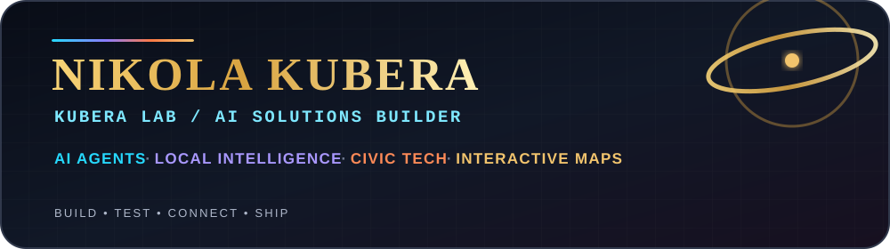

<p align="right">
  <a href="https://www.coingecko.com/en/coins/monero" title="Monero (XMR)">
    
  </a>
  <a href="https://www.coingecko.com/en/coins/monero" title="Live XMR/USD price">
    
  </a>
</p>

<p align="center">
  
</p>

<p align="center">
  
  
  
  
</p>

I build practical AI systems, local-intelligence tools, interactive maps and digital products that connect **real-world experience with useful technology**.

My current work is developing along three connected lines:

- 🤖 **AI Agents & Local AI** — private, modular agent systems and reusable skills.
- 🌍 **Global Mapping & Local Intelligence** — travel-based place publishing and geographic knowledge.
- 🏛️ **Civic Tech & Community Tools** — maps and digital systems that help people understand places, services and local opportunities.

<br>

<p>
  
</p>


    

<br>

<p>
  
</p>

**Kubera Guide** is a travel-based Google Maps project: real places are visited, photographed, documented and published so other people can discover and read the contributions.

Current public reach:

- 👁️ **1.1M Google Maps views**
- ✨ **1.8K profile impressions**
- 🌍 international travel and location publishing
- 📷 real-world photos and place information

**Project flow:**  
Travel → discover places → photograph & document → publish on Google Maps → audience views → geographic knowledge → interactive maps and civic-tech.

➡️ **[Explore the Kubera Guide project](https://github.com/jobkubera-lab/jobkubera-lab/tree/main/kubera-lab/kubera-guide-global-mapping)**  
🌍 **[View Kubera Guide on Google Maps](https://www.google.com/maps/contrib/111907570264362429428?utm_source=mstt_0&g_ep=CAESBzI2LjMzLjIYACCBvQQqqQEsOTQyNjc3MjcsOTQyOTIxOTUsOTQyOTk1MzIsMTAwNzk2NDk4LDEwMDc5Nzc2MSwxMDA3OTY1MzUsOTQyODA1NzYsOTQyMDczOTQsOTQyMDc1MDYsOTQyMDg1MDYsOTQyMTg2NTMsOTQyMjk4MzksOTQyNzUxNjgsOTQyNzk2MTksMTAwODE1NjQwLDEwMDgyMDIzNywxMDA4MjI0ODksMTAwODI3OTcxQgJHQg%3D%3D&skid=9d39cad4-d69e-433c-81c5-5e65fff3327e&g_st=atm)**

<br>

<p>
  
</p>

I am developing **KUBERA AGENT OS** — a private, modular operating layer for a personal/local AI agent.

The system is designed around a simple principle: **the model is replaceable; the user's memory, rules, skills, evidence and projects remain under the user's control.**

Core architecture includes model routing, project memory, skill permissions, evidence tracking, self-checking, privacy gating, failure memory, human-control levels and an agent laboratory for testing new skills before they are trusted.

🔒 **Core source code is kept private.** Public documentation and demos expose the concept and results without publishing the protected implementation.

### ✨ What I build

- AI agents and intelligent workflow tools.
- Local and privacy-conscious AI systems.
- Prompt systems and reusable LLM workflows.
- Interactive maps and local-service discovery tools.
- Civic-tech prototypes for communities and newcomers.
- Research, documentation and visual AI workflows.
- Educational AI products and creative digital experiences.

<br>

<p>
  
</p>

KUBERA LAB is my practical technology laboratory for building, testing and connecting real projects.

My working method is simple:

**Life experience → idea → technical mechanics → working system → GitHub record.**

I use AI to translate ideas, observations and lived experience into structured technical systems, then preserve their development in GitHub as a long-term project archive.

Current directions include:

- 🌍 **Kubera Guide** — travel, mapping and public place discovery.
- 🤖 **KUBERA AGENT OS** — private modular personal AI-agent architecture.
- 🗺️ **Mitcham / Merton community mapping** — local-service and newcomer-oriented map concepts.
- 🧠 **AI Agents** — practical assistants and workflow automation.
- 📊 **Technology Radar** — structured evaluation of emerging technologies.
- 🔒 **AI Privacy** — privacy-aware local AI concepts.
- ⚙️ **Automation** — workflows using APIs, Python and no-code/low-code tools.
- 🏛️ **Civic AI** — digital tools for communities and local services.
- 🌌 **Cosmic English Adventures** — AI-assisted educational universe combining cartoons, English learning and printable activities.

**Explore KUBERA LAB:**  
https://github.com/jobkubera-lab/jobkubera-lab/tree/main/kubera-lab

<br>

<p>
  
</p>

- **[Kubera Guide — Global Mapping Project](https://github.com/jobkubera-lab/jobkubera-lab/tree/main/kubera-lab/kubera-guide-global-mapping)** — 1.1M-view travel and Google Maps publishing project.
- **[kubera-ai-prompts](https://github.com/jobkubera-lab/kubera-ai-prompts)** — reusable prompt systems and AI workflows.
- **[kubera-improved-website](https://github.com/jobkubera-lab/kubera-improved-website)** — web experiments and community-map work.
- **[Cosmic English Adventures](https://github.com/jobkubera-lab/jobkubera-lab/tree/main/kubera-lab/cosmic-english-adventures)** — cartoons + English learning + colouring-book educational concept.

### 🧭 Project evolution

```text
Travel & place discovery
        ↓
Google Maps / Kubera Guide — 1.1M views
        ↓
Interactive community maps
        ↓
Local-data and civic-tech experiments
        ↓
AI agents and local intelligence
        ↓
KUBERA AGENT OS
```

### 🐍 Contribution trail

<picture>
  <source media="(prefers-color-scheme: dark)" srcset="https://raw.githubusercontent.com/jobkubera-lab/jobkubera-lab/output/github-contribution-grid-snake-dark.svg" />
  <source media="(prefers-color-scheme: light)" srcset="https://raw.githubusercontent.com/jobkubera-lab/jobkubera-lab/output/github-contribution-grid-snake.svg" />
  
</picture>

<br>

<p>
  
</p>

### 🤝 Open-source participation

I use GitHub not only as storage, but as a development record: branches, pull requests, reviews, issues, experiments and documented iterations.

I am especially interested in contributing to open-source projects connected with:

- AI agents and agent skills;
- local / private AI;
- maps and geospatial tools;
- civic-tech;
- developer productivity and automation.

### 🧑‍💼 About me

- AI solutions builder creating practical products, agents, maps and digital experiences.
- AI generalist focused on useful systems rather than technology for technology's sake.
- Builder with a global perspective shaped by first-hand travel and location research.
- Interested in partnerships where AI can improve real services, learning and everyday life.

### 💡 Mission

> **Build useful technology. Connect real-world experience with AI. Keep the core trustworthy, explainable and under human control.**

### 🔗 Connect

<p>
  <a href="mailto:jobkubera@gmail.com"></a>
  <a href="https://t.me/kuberababa"></a>
  <a href="https://github.com/jobkubera-lab"></a>
</p>

<p align="center"><sub>Thanks for visiting my work.</sub></p>
